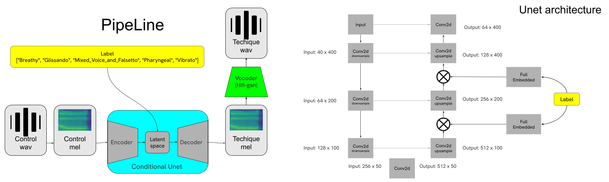
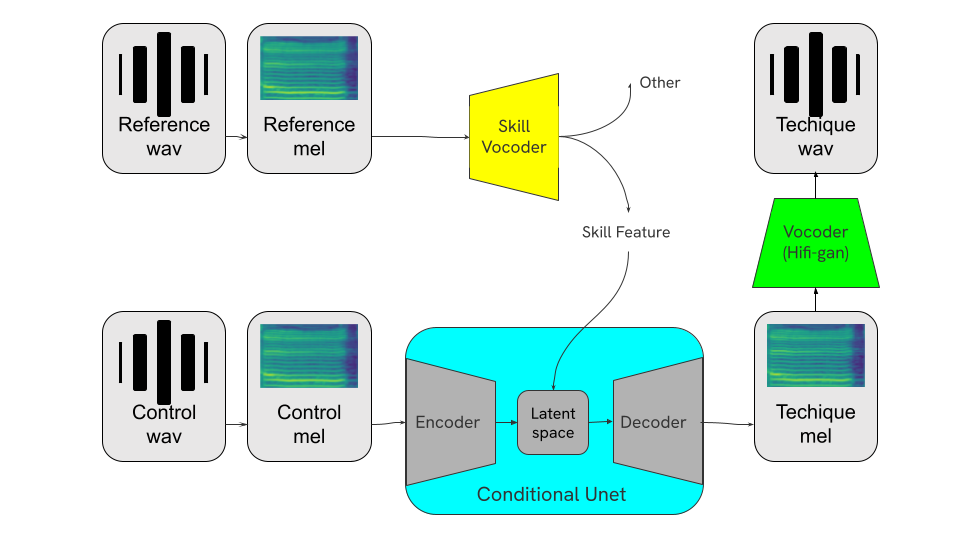

# BAD SINGER SAVIOR

### **README file was lastly edited on 12/31 by yohe**

This repo is an implement of final project from course Music Information Research . The main idea of our work is to train a model that can add singing skill (Breathy,  Glissando, Mixed_Voice_and_Falsetto, Pharyngeal, Vibrato) to a wav without these skill.


## Preparation

1. Dataset: We use GTsinger as our dataset, please download at [here](https://drive.google.com/drive/folders/1xcdvCxNAEEfJElt7sEP-xT8dMKxn1_Lz). We only use Chinese section as our experiment dataset.
2. Enviroment: run the following code to install the environment:
``` bash
pip install -r requirements.txt
```

## How to run our code
Our code has two way to run: using jupiter notebook or terminal directly. 
In this section, I will only introduce how to run our code by terminal.

### training
run the following code to train your model:
``` bash
python train.py --output_path output\  # model output path
                --dataset_path ..      # dataset path (place to put Chinese folder)     
```

### influence
run the following code to influence your model:
``` bash
python influence.py --output_path output\      # generated wav output path
                    --testing_path test.wav\   # control wav
                    --model_path cond.pt       # model path
                    --condition 1              # singing skill. (0, 1, 2, 3, 4) => (Breathy,  Glissando, Mixed_Voice_and_Falsetto, Pharyngeal, Vibrato)
```

## Unet version
In unet folder, there are three unet architecture. `unet.py` is directly copied from stylesinger, `unet_1.py` is the version that we slightly modified. `unet_2.py` is the version that we add conditional embedded.

## future pipeline
